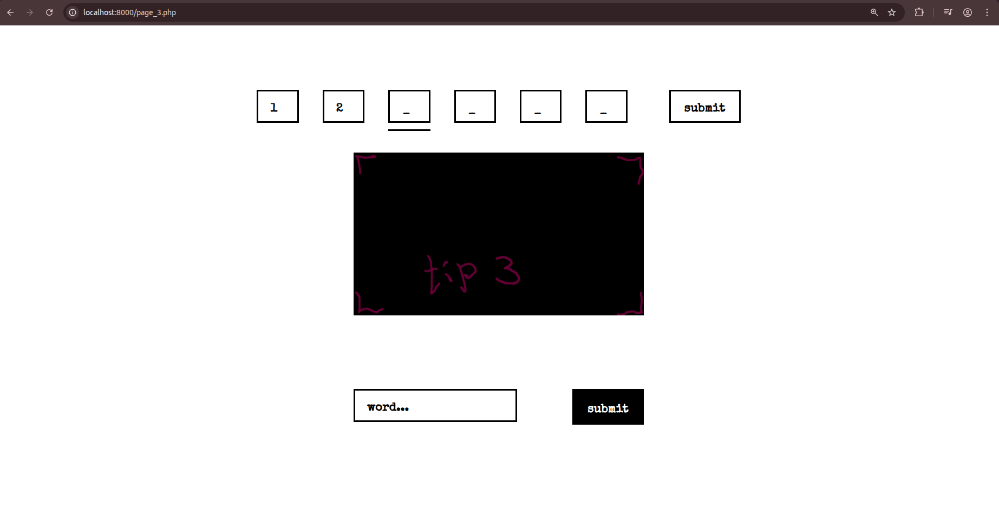

# KILLING QUEST



## 🤨 Навіщо ?:
із цього можна зробити квест дял когось

## 🤓 Опис:
це заготовка для квеста із угадуванням по одній цифрі а потім ключового слова. спочатку сторінка із погодженням із правилами, потім самий квест, потім перезід на сторінку де ти отримуєш токен (який ти сам вказуєш для того щоб знати що користувач не халтурить)

## ☠️ Використані технології:
- PHP (дляя логіки)
- HTML (для розмітки сторінки)
- CSS (для краси і естетики)

## 🌱 Структура проекта:
- `css/` — css файли для естетики і графіки
- `fonts/` - папка зі шрифтами
- `img/tips/` — папка із малюнками підказками (можна змінювати, бо там зараз просто заглушки лежать)
- `screenshots/` — не потрібно для роботи сайта, тут лише скріншоти
- `agreement.php` — сторінка підтвердження із правиллами
- `index.php` — головний файл, його можна запускати, точка входу
- `page_2.php` — остання сторінка із токеном
- `page_3.php` — головна сторінка із квестом вгадування символів

## 😎 Як це запустити ?:
1. встановлюємо необхідні пакети
```bash
sudo apt update
sudo apt install php
```
2. запускаємо програму
```bash
cd "папка де лежить index.php"
php -S localhost:8000
```
3. в браузері заходимо на URL `http://localhost:8000`

## ❓ Швидкі питання і відповіді
1. "можна підглянути через інспектор на правильні відповіді ?" - "ні. для цього треба розкоментувати в коді сторінки `page_3.php` рядок `settings oncontextmenu="return false;`"
